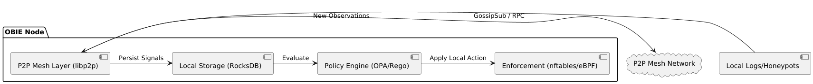
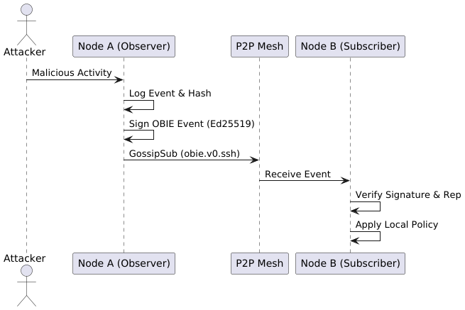
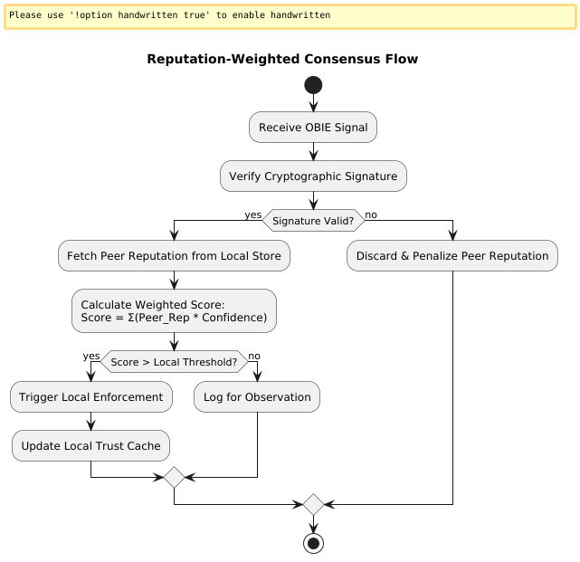

# OBIE: Open Ban Intelligence Exchange

## Status & building

OBIE is in early development: the v0.1 reference implementation in Go is being
built on top of this whitepaper. `obied`, the node daemon, validates its
configuration, runs until SIGTERM/SIGINT, reloads its configuration on
SIGHUP and serves health endpoints
(`/healthz`, `/readyz`, `/metrics`); on its first start it generates the
node's Ed25519 identity key in `<state_dir>/node.key`. It joins the libp2p mesh
under that identity, stays connected to the configured `mesh.bootstrap`
peers and gossips signed verdicts and revocations with them, relaying only
valid events within per-publisher and per-peer rate limits. It keeps a
trust-weighted decision (`block`, `none` or `allowed`) for every indicator
it holds verdicts on and explains it on request. The operator has the last
word: loopback, private, link-local, documentation and the node's own and
bootstrap peers' addresses are never blocked, `allowlist.cidrs` and
`allowlist.files` add more, and `obiectl allow` / `obiectl block` overrule
the mesh for any address. A node starts in `observe` mode and never
enforces until `node.mode: enforce` is set; then a reconcile loop keeps the
enforcement backend exactly in line with the decided blocks, capped at
`enforce.max_entries` and never touching allow-listed addresses. The default
`dryrun` backend only logs what it would block; the `nftables` backend
drops blocked sources through its own table `inet obie` and never touches
any other ([guide](documentation/guides/nftables.md)). `obiectl`, the operator CLI, queries it over the
local admin socket and turns local detections into signed verdicts: log
lines given as evidence are hashed on the node, and only the hash and the
counts are published.

```sh
make build           # static binaries in ./bin/
./bin/obied --version
./bin/obied --config documentation/examples/obie.yaml --check-config
./bin/obied --config /etc/obie/obie.yaml
./bin/obied keygen [--force] [--config file | --state-dir dir]   # offline, as the service user
./bin/obied identity [--json] [--config file | --state-dir dir]  # offline: peer ID + fingerprint
./bin/obiectl [--socket /run/obie/obie.sock] [--timeout 10s] status [--json]
./bin/obiectl --socket /run/obie/obie.sock identity [--json]
./bin/obiectl --socket /run/obie/obie.sock peers [--json]      # connected mesh peers
./bin/obiectl --socket /run/obie/obie.sock explain [--json] 198.51.100.7  # why (not) blocked
./bin/obiectl --socket /run/obie/obie.sock decisions [--state block|none|allowed] [--json]
./bin/obiectl --socket /run/obie/obie.sock allow <ip|cidr> [--ttl 7d] [--note text]  # never block
./bin/obiectl --socket /run/obie/obie.sock block <ip|cidr> [--ttl 1h] [--note text]  # always block
./bin/obiectl --socket /run/obie/obie.sock overrides [--json]
./bin/obiectl --socket /run/obie/obie.sock unoverride <ip|cidr>
./bin/obiectl --socket /run/obie/obie.sock enforced [--json]    # entries the backend applies
./bin/obiectl report --protocol ssh --reason password_bruteforce --events 5 \
    [--evidence-file auth.log | --evidence-from-stdin] [--ttl 12h] [--action watch] \
    [--json] <ip | cidr>                     # publish a verdict (or --ip <ip | cidr>)
./bin/obiectl revoke [--reason false_positive] <ip | cidr | event-id>             # withdraw it
./bin/obiectl indicators [--mine | --publisher <peer-id>] [--json]                # active verdicts
./bin/obiectl show [--json] <ip | cidr>                                            # verdicts on one
kill -HUP "$(pidof obied)"   # reload allow-list files, trust, decision settings and mode
make ci              # every check a change must pass
```

A node is configured with one YAML file (default `/etc/obie/obie.yaml`);
[documentation/examples/obie.yaml](documentation/examples/obie.yaml) documents
every key and its default. To publish Fail2Ban bans as verdicts, add the
ready-made action to your jails; see
[documentation/guides/fail2ban.md](documentation/guides/fail2ban.md).

Requires Go 1.26 or newer. Every pull request is gated by the same `make ci` in
CI. See [ARCHITECTURE.md](ARCHITECTURE.md) for the technical baseline and
[CONTRIBUTING.md](CONTRIBUTING.md) for how to contribute. The wire protocol is
specified in [documentation/spec/obie-0.1.md](documentation/spec/obie-0.1.md).

The whitepaper follows below. It describes the long-term vision; statements
marked *(planned)* are not implemented in v0.1 (see
[the deviations in ARCHITECTURE.md](ARCHITECTURE.md#deviations-from-the-whitepaper)).

---

## A Decentralized, Federated Security Mesh for the Modern Internet

### Abstract

Modern security operations are increasingly burdened by a centralized paradox: defending against distributed attacks
using centralized intelligence. This paper introduces OBIE (Open Ban Intelligence Exchange), a decentralized Security
Operations Center (SOC) framework built on a peer-to-peer (P2P) mesh. OBIE allows autonomous security nodes to share
cryptographically signed attacker signals, enabling collective defense without surrendering local sovereignty to central
authorities or commercial choke points. By combining reputation-weighted consensus, evidence-backed transparency, and a
leaderless architecture, OBIE provides a resilient, privacy-preserving infrastructure for global threat mitigation.

### 1. Introduction: The Centralization Trap

The current state of internet security is a landscape of "trust us" empires. Defensive intelligence is largely
concentrated in the hands of a few major vendors and cloud providers. While efficient, this centralization introduces
critical failure modes:

- **Single Points of Failure:** A compromise or outage at a central intelligence provider leaves millions of nodes
  vulnerable.
- **Commercial Choke Points:** Access to quality threat data is often behind paywalls, creating a security divide
  between large enterprises and smaller operators.
- **Opacity and Bias:** Centralized authorities can silently decide what constitutes a threat, potentially weaponizing
  security feeds for censorship or corporate interests.
- **Latency:** Decisions made at the "mothership" often reach the edge too late to mitigate fast-moving automated
  attacks.

OBIE proposes a shift from the "police state" model of broadcasting arrest warrants to a "neighborhood watch" model
where informed defenders exchange case notes.

### 2. The OBIE Manifesto: Principles and Philosophy

The design of OBIE is governed by ten core principles that ensure the system remains a shield, not a spear:

1. **Evidence Above Authority:** Trust is earned from verifiable data, not badges. Signals are signed and include
   evidence hashes.
2. **Unsurrendered Autonomy:** Every node decides its own local policy. External intelligence is advisory, never
   mandatory.
3. **Transparency Protects Liberty:** All signals are signed and reputation is observable. Mistakes must be correctable.
4. **Decentralization as a Safeguard:** There is no central oracle or "kill switch." Power is distributed across the
   mesh.
5. **Privacy by Default:** Nodes share indicators (IPs, fingerprints), not user identities or raw logs.
6. **Practicality Above Purity:** If it cannot be deployed by a competent engineer in a weekend, it is research, not
   production.
7. **No Economic Tokens:** Incentives come from mutual defense, not speculation or imaginary fortunes.
8. **Failure Tolerance:** The system must degrade gracefully as nodes fail or keys rotate.
9. **Defense is the Mission:** OBIE does not punish, retaliate, or hunt. It increases friction for attackers.
10. **Governance by Contribution:** Influence comes from usefulness and historical accuracy, not status.

### 3. System Architecture

OBIE is designed as a lightweight overlay network that integrates with existing security tooling.



#### 3.1 P2P Mesh Layer

The foundation of OBIE is a leaderless P2P mesh built on `libp2p`.

- **Discovery:** Nodes use a Kademlia-based Distributed Hash Table (DHT) for decentralized peer discovery *(planned)*; v0.1
  uses static bootstrap peers.
- **Identity:** Each node maintains a persistent Ed25519 peer ID. Organizational identity is optionally bound via domain
  challenges (ACME/`.well-known`) *(planned)*.
- **Messaging:** High-confidence signals are broadcast via GossipSub topics (e.g., `obie.v0.ssh`, `obie.v0.http`) *(planned)*; v0.1
  uses the single topic `obie/0.1/verdicts`. Targeted RPC (Remote Procedure Call) is used for direct evidence fetching
  and appeals *(planned)*.

#### 3.2 Data Model: OBIE Events

Events are normalized JSON objects (or CBOR/COSE for efficiency *(planned)*) containing indicators, evidence, and verdicts.



##### 3.2.1 Technical Schema

The normative definition of the v0.1 event format — every field and its constraints, event semantics, indicator
normalization, canonicalization and signing, transport, validation rules, privacy and security considerations — is the
[obie/0.1 protocol specification](documentation/spec/obie-0.1.md), with a
[JSON Schema](documentation/spec/obie-0.1.schema.json) and
[signing test vectors](documentation/spec/test-vectors/README.md).

A typical OBIE verdict event includes high-fidelity metadata allowing the subscriber to verify the claim's provenance
and local relevance (the IPv6 address is from the documentation range, which real nodes reject):

```json
{
  "id": "uuid-v7",
  "spec": "obie/0.1",
  "type": "indicator.verdict",
  "issued_at": "2026-01-05T01:50:00Z",
  "indicator": {
    "kind": "ipv6",
    "value": "2001:db8:6c::dead:beef",
    "scope": "/128"
  },
  "protocol": "ssh",
  "evidence": {
    "events": 47,
    "reason": "password_bruteforce",
    "log_hash": "sha256:1b4a...",
    "honeypot": true
  },
  "verdict": {
    "suggested_action": "ban",
    "confidence": 0.92,
    "ttl_seconds": 604800
  },
  "publisher": {
    "peer_id": "12D3KooW...",
    "asn": 64512,
    "signature": "ed25519:..."
  }
}
```

OBIE supports a broad range of indicators beyond simple IP addresses, and events are typically tagged with **MITRE ATT&CK® techniques** (e.g., T1110 for Brute Force) to provide immediate context for detection engineers. Supported indicator types include:
- **Network:** IPv4/v6, CIDR blocks, ASNs *(planned)* — v0.1 supports public IPv4/IPv6 addresses and CIDR blocks.
- **Service:** FQDNs, URLs *(planned)*.
- **Fingerprints:** JA3/JA4 (TLS), SSH key fingerprints, HTTP fingerprints *(planned)*.
- **File:** SHA256 hashes of malicious payloads observed in-flight *(planned)*.

#### 3.3 The Tech Stack

The reference implementation utilizes:

- **Language:** Go (for static binaries and `libp2p` maturity).
- **Storage:** RocksDB/BadgerDB for local state (v0.1: BadgerDB); CRDTs for distributed reputation consistency *(planned)*.
- **Policy Engine:** OPA (Open Policy Agent) using Rego to map network signals to local actions *(planned)*; v0.1 uses a
  built-in weighted-score decision.
- **Enforcement:** `nftables` (Linux), `eBPF` for high-rate drops *(planned)*, or shims for `Fail2Ban` *(planned)*.

### 4. Decentralized Trust and Reputation

In a leaderless system, trust is the primary currency. OBIE implements a multidimensional reputation model *(planned)*; in
v0.1 operators assign a trust weight to each publisher:

#### 4.1 Scoring Dimensions

A node's reputation is computed locally by its peers based on:

- **Accuracy:** Alignment with honeypot validation and peer corroboration.
- **Stability:** Consistent long-term behavior without suspicious spikes.
- **Transparency:** Availability of signing keys, org metadata, and appeal endpoints.
- **Penalty History:** Reductions for false positives or attempted poisoning.

#### 4.2 Weighted Consensus

Nodes do not blindly follow signals. Instead, they calculate a weighted confidence score locally to determine if an enforcement action is warranted. This prevents a single malicious or compromised node from poisoning the local firewall.



The consensus algorithm follows a Bayesian-inspired weighting:
`Local_Score = Σ (Peer_Reputation_i * Signal_Confidence_i)`

To trigger automatic enforcement (e.g., a `DROP` rule), a signal must typically meet a "Diversity Quorum":
- **Weighted Score Threshold:** The aggregate score must exceed a locally defined limit (default: 1.8).
- **ASN Diversity:** Corroboration must come from at least 3 distinct Autonomous Systems (ASNs) *(planned)*; v0.1 requires a
  minimum number of distinct publishers (default: 2).
- **Org Diversity:** Reports must originate from at least 3 unique verified organizations *(planned)*.

#### 4.3 Detection Lifecycle & Remediation

OBIE transitions signals through a formal lifecycle to ensure accuracy and permit correction:
1. **Observation:** A node detects malicious activity and generates an `indicator.observed` event *(planned)*; in v0.1
   observations stay local.
2. **Verdict:** Once local confidence is high, the node publishes an `indicator.verdict`.
3. **Corroboration:** Peer nodes receive the verdict, verify the signature, and update their local consensus score for that indicator.
4. **Enforcement:** If thresholds are met, the subscriber's local policy engine (OPA *(planned)*) triggers enforcement via `nftables` or `eBPF` *(planned)*.
5. **Revocation/Appeal:** If a signal is found to be a false positive, the original issuer can broadcast an `indicator.revoke`. Alternatively, the subject of a ban can submit an `indicator.appeal` (signed with proof of IP ownership) for human or automated review *(planned)*.

### 5. Security and Resilience: Defending the Mesh

As a defensive tool, OBIE must resist being weaponized.

#### 5.1 Poisoning and Sybil Resistance

- **Identity Barriers:** Anonymous publishing is rejected. Cryptographic identity (verified via domain/ACME *(planned)*) is required
  to participate in the reputation pool *(planned)*.
- **Rate Limiting:** Strict quotas are applied per-identity and per-ASN to prevent flood-based DoS; v0.1 limits the
  events accepted per publisher and per forwarding peer, per-ASN quotas are *(planned)*.
- **Reputation Warm-up:** New nodes have limited influence until they prove value over time *(planned)*.

#### 5.2 Local Sovereignty as a Fail-safe

The ultimate defense is local policy. A node's internal allow-list (local networks, critical gateways, DNS) always
overrides external signals. If the mesh is compromised, an operator can flip their node to "observe-only" mode without
losing local protection.

#### 5.3 Operational Integration: SIEM and SOAR

OBIE is designed to be "boringly robust" and integrates seamlessly with the modern security stack:
- **SIEM Ingestion:** All OBIE events are exported as structured JSON/ECS-compliant logs, ready for ingestion into ELK/Loki/Splunk *(planned)*.
- **SOAR Orchestration:** Playbooks can use OBIE's RPC layer to fetch evidence hashes for manual forensic validation *(planned)*.
- **Monitoring:** Native Prometheus metrics provide real-time visibility into ban propagation rates, signature failures, and ASN diversity metrics (ASN diversity metrics *(planned)*).
- **Honeypot Enrichment:** Integration with Cowrie or T-Pot allows nodes to contribute "high-precision" signals derived from verified attacker interactions *(planned)*.

### 6. Implementation Roadmap

The development of OBIE follows a pragmatic, three-tier maturation arc.

- **Phase 1: MVP (1-2 Months):** Functional publisher/subscriber pair. Integration with `Fail2Ban` and `nftables`.
  Static bootstrap nodes.
- **Phase 2: Usable Beta (4-6 Months):** Gossip-based discovery, identity onboarding, basic trust scoring, and
  observability (Grafana/Prometheus).
- **Phase 3: Industry-Ready Mesh (18-30 Months):** Peer reputation weighting with decay, ASN diversity checks, formal
  security audits, and a federated appeals process.

### 7. Governance and Sustainability

OBIE is a protocol, not a product.

- **Audience:** Targeted at hosting providers, SOC platforms (Wazuh, CrowdSec), and security-conscious homelabs.
- **Funding:** Prefer small grants (e.g., NLNet, EU Horizon) and a consortium of mid-size operators to prevent capture
  by any single entity.
- **Enemies:** Opposition is expected from authoritarian regimes (who lose control) and commercial vendors (who lose
  lock-in). OBIE survives by being "boringly robust" and transparently humble.

### 8. Conclusion

The internet deserves a defense that is as resilient and distributed as the threats it faces. OBIE provides the
framework for such a defense—one that prioritizes evidence over authority and autonomy over efficiency. By laying a
foundation of cryptographic accountability and shared intelligence, OBIE empowers defenders to cooperate without
hierarchy, ensuring that the future of security is open, federated, and incorruptible.

---
**OBIE: Shared Intelligence, Sovereign Enforcement.**
