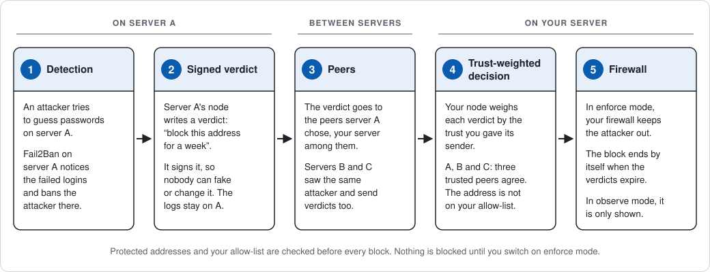

# What is OBIE?

OBIE, the Open Ban Intelligence Exchange, lets servers warn each other
about attackers. Each server still decides for itself what it blocks. This
page explains in about five minutes what that means, how it works and how
you stay in control of your own server. You need no technical background
to follow it.

## The problem: every server fights alone

Every server on the internet is attacked all day. Automated programs try
thousands of passwords and look for weak spots. They attack from internet
addresses (IP addresses), and the same addresses hit thousands of
servers.

Yet each server has to learn about an attacker the hard way: by being
attacked itself. A tool such as [Fail2Ban](glossary.md#fail2ban) notices
the failed logins and shuts the attacker out, but only on that one server.
The next server starts from nothing.

The usual shortcut is a blocklist: a list of bad addresses from one
provider. You have to trust that provider completely, often without seeing
why an address is on the list. When the provider makes a mistake, everyone who
uses the list is affected at once.

## The idea: servers warn each other

Each server runs a small OBIE program, called a [node](glossary.md#node).
When a server is attacked, its node writes a short warning, for example:
"this address attacked me, block it for a while". OBIE calls this warning a
[verdict](glossary.md#verdict).

Every verdict carries a digital [signature](glossary.md#signature): a seal
that proves which node wrote it and that nobody changed it on the way. A
forged or altered verdict is thrown away.

A node shares its verdicts with its [peers](glossary.md#peer), the other
nodes it is connected to, and they pass them on. You choose the nodes your
node connects to, such as a friend's server, a partner organisation or
another server of your own.
There is no central service, no account and no company in the middle that
decides for you. Nobody can switch OBIE off for everyone, and you can
switch off your own node at any time.

## What happens on your server

A verdict is advice, never an order. Your node alone decides what to do
with it.

For each peer, you set a [trust weight](glossary.md#trust-weight): a
number from 0 to 1 that says how much you trust its judgement. A friend
you know well might get 0.8. By default, nodes you have not listed count
for nothing, even if they connect, so strangers cannot vote.

For every reported address, your node adds up what the verdicts are worth.
Each verdict counts with the trust you gave its sender. Your node blocks
the address only when two conditions are met:

- The total reaches a limit you set, the
  [threshold](glossary.md#threshold).
- Enough different nodes agree, the [quorum](glossary.md#quorum).

With the default settings, one peer alone can never get an address blocked
on your server. If you give each peer a trust of 0.8, it takes at least
three peers who agree.

Your server's own detections are different. When your own Fail2Ban bans an
address, your node decides to block it at once, because you trust your own
server fully.

A block based on verdicts ends on its own when they run out, so a mistake
does not last forever. You can ask your node at any time why an address is
or is not blocked. And you can overrule your peers for any address: always
allow it, or always block it. OBIE calls this an
[override](glossary.md#override). If a customer or an employee is blocked
by mistake, your administrator allows their address and the block is
lifted at once.

## What can never happen

You keep control of your server, whatever other nodes say. OBIE calls this
principle [sovereignty](glossary.md#sovereignty).

- **Your server's own addresses and the protected addresses are never
  blocked.** Also protected: the peers you told your node to connect to,
  and internal addresses that the internet cannot reach. Nothing blocks
  them, not even you by hand. The addresses you work from, such as your
  office's internet address, go on your [allow-list](glossary.md#allow-list).
  Then OBIE never blocks them, whoever reports them.
- **Nothing is enforced until you switch it on.** A new node starts in
  [observe mode](glossary.md#observe-mode). It decides, including on your
  own server's detections, and shares its verdicts with your peers, but only
  lists what it would block, for your administrator to review. It does not
  touch your [firewall](glossary.md#firewall), the part of your server that
  lets connections in or keeps them out. It only blocks once you switch it
  to [enforce mode](glossary.md#enforce-mode) yourself. Even then it only
  changes its own part of the firewall, never the settings your
  administrators made.
- **Raw logs never leave your server.** A verdict carries the number of
  failed attempts and a fingerprint of the log lines: a short code that
  cannot be turned back into the lines. User names, passwords and the
  contents of your logs are never shared.

What other nodes do learn: which address attacked your server, on which
service (such as the website or remote login) and when. That is a small
privacy cost: it hints at which services you run, and they see your server's
internet address. Attacker addresses can count as personal data under data
protection law such as the GDPR, so check with your data protection officer.
The [FAQ](faq.md#what-does-obie-share-about-me) lists exactly what is
shared.

## One attack, start to finish

The same journey in words:

1. **Detection.** An attacker tries to guess passwords on server A, and
   Fail2Ban there bans it.
2. **Signed verdict.** Server A's node writes and signs a verdict: "block
   this address for as long as I ban it". The log lines stay on server A.
3. **Peers.** The verdict goes to server A's peers, your server among them.
   Servers B and C, also your peers, saw the same attacker and send their
   own verdicts.
4. **Trust-weighted decision.** Your node weighs each verdict by the trust
   you gave its sender. Three trusted peers agree, which is enough. The
   address is not on your allow-list.
5. **Firewall.** In enforce mode, your firewall now keeps the attacker out.
   The block ends by itself when the verdicts expire. In observe mode, your
   node only lists the block for you to review.

## Is OBIE for you?

OBIE may be for you if:

- You run Linux servers that are reachable from the internet.
- You already use Fail2Ban, or would like to.
- You know other server operators you trust enough to exchange warnings
  with, or you run several servers yourself.

OBIE is not for you yet if:

- Your servers run Windows or any system other than Linux.
- You have a single server and nobody to exchange warnings with. On its
  own, OBIE adds little to what Fail2Ban already does.
- You want to join a ready-made public network. In this first version, you
  connect to each peer by hand.
- You need a mature product with support. OBIE is at version 0.1, its
  first release.

Deciding for others? Ask whoever runs your servers whether they run Linux
and Fail2Ban. OBIE is free and open source, with no account and no subscription,
and runs next to your existing tools.

## Where to go next

- [Frequently asked questions](faq.md): lockouts, privacy, crashes, and
  how OBIE differs from blocklists.
- [Glossary](glossary.md): every OBIE term, briefly explained.
- [What version 0.1 does, and does not do yet](../README.md#what-v01-does).
- [Try it on a laptop](../packaging/compose/README.md): three nodes that
  block nothing real.
- [Quick start](operations/quickstart.md): a first node, safely in observe
  mode.
- [Threat model](../SECURITY.md#threat-model): the risks that remain.

Anything unclear? Please
[tell us in an issue](https://github.com/MNCloudwerksTechnology/OBIE-Open-Ban-Intelligence-Exchange/issues).
